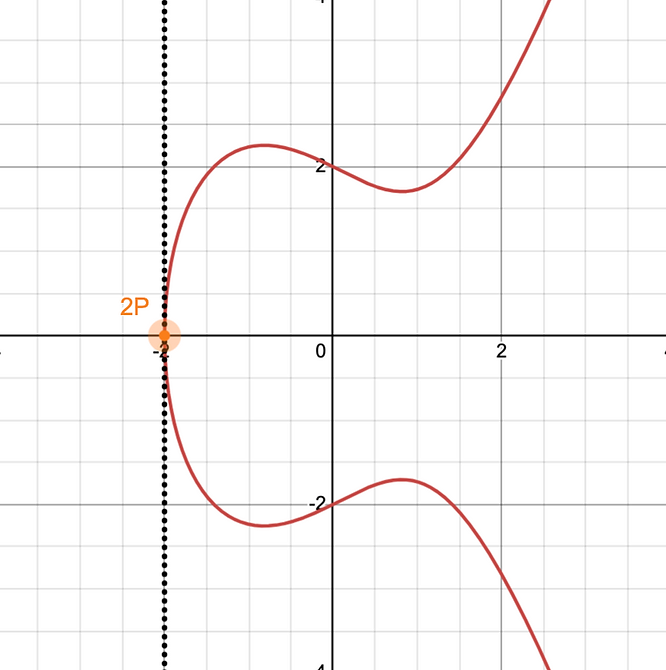

# Elliptic Curves over ℝ

[Elliptic curves](https://mathworld.wolfram.com/EllipticCurve.html#:~:text=Formally%2C%20an%20elliptic%20curve%20over,%2C%20or%20a%20finite%20field.) have applications in various mathematical fields, including [**number theory**](https://mathworld.wolfram.com/NumberTheory.html#:~:text=Number%20theory%20is%20a%20vast,the%20properties%20of%20whole%20numbers.) and [**cryptography**](https://mathworld.wolfram.com/Cryptography.html).

---

    

## Definition

An **elliptic curve** over \( \mathbb{R} \) is defined by a [cubic equation](https://mathworld.wolfram.com/CubicEquation.html#:~:text=A%20cubic%20equation%20is%20an,solutions%20of%20a%20cubic%20equation.) of the form:
$$ y^2 = x^3 + Ax + B $$

where \( A \) and \( B \) are [real coefficients](https://mathworld.wolfram.com/Coefficient.html).

When these coefficients satisfy the condition:
$$ 4A^3 + 27B^2 \neq 0 $$

the curve is [**non-singular**](https://mathworld.wolfram.com/Determinant.html).

Elliptic curves that do not satisfy this condition are called **singular elliptic curves**.

### **The Weierstrass Equation**

In the form:
$$ y^2 = x^3 + Ax + B $$

an elliptic curve is said to be in the **Weierstrass Equation form**.

There are [more general equations that define elliptic curves](https://mathworld.wolfram.com/EllipticCurve.html) over \( \mathbb{R} \) ([Washington, L. C., 2008, pp. 35-42, Section 2.5](acknowledgements-bibliography.md)). However, elliptic curves can be [**converted** into the Weierstrass Equation form](https://crypto.stanford.edu/pbc/notes/elliptic/weier.html) when defined across fields with [a characteristic other than **2 or 3**](https://mathworld.wolfram.com/EllipticCurve.html).

---

## Animation of ECs in the Weierstrass form

See below, an animation of different elliptic curves in the Weierstrass Form, for varying values of the coefficients A and B (in the equation \( y^2 = x^3 + Ax + B \)):

  <video width="640" height="360" controls>
    <source src="vid/weierstrass-form.mp4" type="video/mp4">
    Your browser does not support the video tag.
  </video>

---

    

## Geometric Features

### **Discriminant and Shape**

The shape of an elliptic curve in Weierstrass form depends on the **discriminant**:
$$ \Delta = -16(4A^3 + 27B^2) $$

([Washington, L. C., 2008, pp. 9-11, Section 2.1](acknowledgements-bibliography))

---

    

- If **\( \Delta < 0 \)**, the curve is a **single, connected loop**.  
  The cubic equation: \( x^3 + Ax + B = 0 \) has **one real solution**.

- If **\( \Delta > 0 \)**, the curve consists of **two disjoint loops**.  
  The cubic equation: \( x^3 + Ax + B = 0 \) has **three real solutions**.

**Note:** The definition of these "loops" will become clearer once we introduce the concept of [**the point at infinity**](projective-plane). For now, we accept that the far end of each curve **connects at infinity**.

### **Symmetry**

Every elliptic curve in Weierstrass form is **symmetric** about the **x-axis**.  
If \( (x, y) \) is on the curve, then so is \( (x, -y) \).

---

    

## Group Law: Addition of Points

Elliptic curves over \( \mathbb{R} \) form a **group** under the operation of **point addition**.

If **\( P \)** and **\( Q \)** are points on the curve, their sum **\( P + Q \)** is defined **geometrically** by:

- Drawing a **line through \( P \) and \( Q \)**.
- Finding its **third intersection point** with the curve.
- Reflecting that point over the **x-axis**.

---

    

### **Special Cases in Point Addition**

#### **When \( P = Q \) (Point Doubling)**

If **\( P = Q \)**, the line through \( P \) and \( Q \) becomes a **tangent line** to the curve at **\( P \)**.
$$ P + P = 2P = -R $$

This means we compute the **slope** as:
$$ m = \frac{x_P^2 + A}{2y_P} $$

[(Washington, L. C., 2008, pp. 13-14, Section 2.2)](acknowledgements-bibliography)

    

#### **When \( y = 0 \)**

If \( P \) lies on the x-axis (\( y = 0 \)), then:
$$ 2P = \mathscr{O} $$

where **\( \mathscr{O} \)** is the **point at infinity**.

#### **Group Identity: The Point at Infinity**

Any vertical line **intersects** the curve at the **point at infinity** \( \mathscr{O} \).

This point acts as the **identity element** for the group:
$$ P + \mathscr{O} = P $$

The **additive inverse** of a point \( (x, y) \) is:
$$ (x, -y) $$

which is simply the **reflection over the x-axis**.

### **The Three-Point Property**

It can be shown that any **straight line** passing through three points on the curve \( (P, Q, R) \) represents:
$$ P + Q + R = \mathscr{O} $$

For this, and many related reasons, the "**point at infinity**" is taken to be the "**additive neutral element**" for the Group defined for Elliptic Curves ([Washington, Section 2.3, pp. 18-20](acknowledgements-bibliography)).

---

## Applications

### **Cryptography**

Elliptic curves over \( \mathbb{R} \) serve as **simpler models** for understanding more **complex cryptographic schemes** over finite fields and rings, including those used in **Elliptic Curve Cryptography (ECC)**.

### **Theoretical Mathematics**

Elliptic curves are studied for their properties in **algebraic geometry** and **number theory**.

---

## Challenges & Considerations

### **Visualization**

Unlike elliptic curves over finite fields (used in cryptography), curves over \( \mathbb{R} \) can be **graphically represented**, making visual learning **more intuitive**.

### **Complexity in Handling**

While real-number elliptic curves are **easier to visualize**, they introduce complexities in ensuring **mathematical rigor**, especially concerning:

- **Limits**
- **Continuity**
- **Differentiability**
