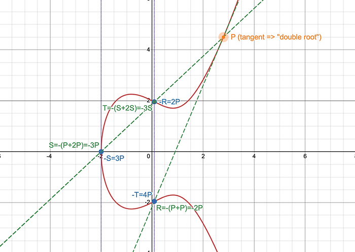
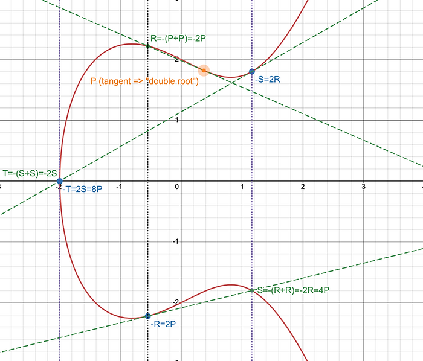

# Adding and Doubling Points: P, 2P, 3P, 4P, 8P, etc.

Adding and doubling points is an essential element of the algebra of **Elliptic Curves**.

## **Adding Points on an Elliptic Curve**

Adding points involves joining the point **\( P \)** to the point **\( Q \)** and finding the point **\( R \)** where the line between **\( P \)** and **\( Q \)** intersects the elliptic curve **\( E \)**.

[As discussed earlier](https://www.creativearts.com.au/article/line-connecting-p-q-intersect-third-point), if the line that passes through **\( P \)** and **\( Q \)** is **not vertical**, that line is guaranteed to pass through **one other point** on the elliptic curve, in the **affine plane**.

### **Doubling a Point (Finding 2P)**

Finding **\( 2P \)** involves taking the **tangent line** to the curve at **\( P \)**. This corresponds to the case where:
$$ P + Q = P + P = 2P $$

If **\( P \)** and **\( Q \)** are the same point (**\( P = Q \)**), the line becomes a **tangent to the curve**. Again, if the **tangent is not vertical**, it will intersect **another point** on the elliptic curve, in the affine plane.

Adding points repeatedly allows you to find:
$$ P, 2P, 3P, 4P, \dots $$

The process follows this pattern:

1. **Find the tangent to the curve** at **\( P \)**.
2. **Locate the second intersection** of that tangent with the curve.
3. **Reflect that intersection point** over the **x-axis** to find **\( 2P \)**.
4. **Find the line passing through \( P \) and \( 2P \)**, locate the intersection, reflect, and get **\( 3P \)**.
5. **Repeat the process** to compute higher multiples **\( 4P, 5P, \dots \)**.

---

### **📽 Animation: Adding Points**

🎞 See the animation below for different values of **\( P, 2P, 3P, \)** and **\( 4P \)** for various starting values of **\( P \)**.

  <video width="640" height="360" controls>
    <source src="vid/adding-points.mp4" type="video/mp4">
    Your browser does not support the video tag.
  </video>

One interesting moment to notice, in this animation, is the instant where:

$$ P = -2P = 4P $$

around timecodes 0:44 and 1:58.

This point is also the inflection point on the curve where the curve shifts from -ve curvature +ve curvature - which allows a point to be drawn through \( P \) (at this exact point) that only intersect the curve once, in such a way that represents a "triple root". That is:

$$ 3 P = \mathscr{O} $$

and so:

$$ 2P = - P \leadsto P = - 2P \leadsto P = 4P $$

---

## **Repeated Doubling (2P, 4P, 8P, ...)**

Doubling a point **repeatedly** requires taking the **tangent to the curve** at **\( P \)**.

1. Compute **\( 2P \)**:

   - Take the tangent at **\( P \)**.
   - Find the **intersection point** and its **reflection** to get **\( 2P \)**.

2. Compute **\( 4P \)**:

   - Use **\( 2P \)** as the starting point.
   - Take the **tangent at \( 2P \)**.
   - Find the **new intersection**, reflect, and get **\( 4P \)**.

3. Compute **\( 8P \)**:
   - Use **\( 4P \)**.
   - Take the **tangent at \( 4P \)**.
   - Find the **new intersection**, reflect, and get **\( 8P \)**.

### **📽 Animation: Doubling Points**

🎞 See animation below for different values of **\( P, 2P, 4P, 8P \)**.

  <video width="640" height="360" controls>
    <source src="vid/doubling-points.mp4" type="video/mp4">
    Your browser does not support the video tag.
  </video>

---

## **The Point at Infinity**

The **point at infinity** on an elliptic curve is the **identity element** of the curve's group structure, serving as the **neutral element** for point addition.

### **Group Identity Property**

For any point **\( P \)**:
$$ P + \mathscr{O} = P $$

where **\( \mathscr{O} \)** is the **point at infinity**.
$$ P + (-P) = P - P = \mathscr{O} $$

---

## **Torsion Points**

**Torsion points** on elliptic curves are special points that have a **finite order**.

### **Definition of Torsion Points**

A point **\( P \)** on an elliptic curve is a **torsion point** if there exists a **positive integer \( n \)** such that:
$$ nP = \mathscr{O} $$

where:

- **\( P \)** is a point on the curve.
- **\( nP \)** represents adding **\( P \)** to itself **\( n \)** times.
- **\( \mathscr{O} \)** is the identity element (the **point at infinity**).

**Note**: the inflection point, mentioned above, where:
$$ 3P = \mathscr{O} $$

is one of these **Torsion Points**.

### **Properties of Torsion Points**

- **Finite Order**:  
  Torsion points have **finite order**, meaning that for some **smallest integer \( n \)**, the repeated addition of **\( P \)** leads to the **point at infinity**.

- **Subgroup Structure**:  
  The set of all torsion points on an elliptic curve forms a **subgroup**, known as the **torsion subgroup** of the curve.

#### **Examples of Torsion Points**

- **\( 6P = \mathscr{O} \)** → The point at infinity.

    

- **\( 16P = \mathscr{O} \)** → The point at infinity.

    

---

## **Torsion Points in Finite Fields**

Torsion points play a **key role in cryptography**, especially in **elliptic curve cryptosystems**. The **security** of these systems often relies on the **size and structure** of the torsion subgroup.

---

## **Theorem Application: Mazur’s Torsion Theorem**

The [**Mazur’s Torsion Theorem**](https://en.wikipedia.org/wiki/Torsion_conjecture#Elliptic_curves) (see as well [\[1\]](https://upcommons.upc.edu/bitstream/handle/2117/328107/memoria.pdf?sequence=1&isAllowed=y#:~:text=From%20the%20arithmetic%20point%20of,an%20elliptic%20curve%20over%20Q.), and [\[2\]](https://planetmath.org/mazurstheoremontorsionofellipticcurves)) provides a remarkable result about the **torsion subgroups of elliptic curves** over **\( \mathbb{Q} \)** (the rational numbers).

It states that the torsion subgroup of any elliptic curve over **\( \mathbb{Q} \)** is isomorphic to one of **fifteen possible groups**, which are either:

- **Cyclic groups** of order **\( n \)** for **\( n = 1 \) to \( 10 \), or \( 12 \)**.
- **Products of two cyclic groups** with specific orders.

Torsion points remain a **key area of research** in number theory and algebraic geometry, providing insights into:

- The **structure of elliptic curves**.
- Applications in **algorithms** and **cryptography**.
