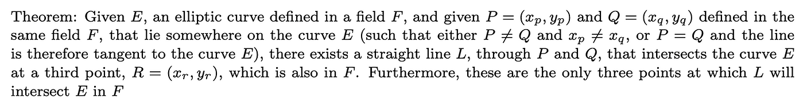

# Theorem / Proof: A Line Connecting P and Q Always Intersects a Third Point

## Introduction

How do we know that a **line connecting \( P \) and \( Q \)** will always intersect **another point** on the curve? This fundamental property allows us to **define a Group Law** for an **Elliptic Curve** over a given Field.

??? abstract "Download the proof"

    click here:
    
    - [A line through P and Q intersects a 3rd point, R](doc/R-exists-in-F-proof.pdf)

## Proof

---

## Considering the Affine Plane

There are **more succinct theorems** that take into account the **point at infinity** in elliptic curves. These theorems can also discuss **vertical lines** (where \( x_P = x_Q \) when \( P \) and \( Q \) are distinct).

However, at this stage in our study of elliptic curves, it is **more informative** to consider the case **strictly within the affine plane** - without introducing [the **point at infinity** or the **projective plane**](100-projective-plane.md). This allows us to explore how far we can take this definition **within that construct**.

### Key Observations

By avoiding the concept of [the **point at infinity**](100-projective-plane.md), we encounter the following limitations:

1. **Not all points on the curve form a strict group in the affine plane**

   - Some points, [when added](070-point-addition.md), do **not exist** in the field on which the curve is defined.

2. **Not all points have an [additive inverse](060-additive-inverse.md)**
   - Without [the **point at infinity**](100-projective-plane.md), some necessary group properties are missing.

Understanding the difference between an **elliptic curve defined on the affine plane** and one that **includes the point at infinity** is **essential** for grasping why the point at infinity is considered the **[additive neutral element](100-projective-plane.md)** of the group.

---

??? abstract "View the proof"

    click here:
    
    - [A line through P and Q intersects a 3rd point, R](doc/R-exists-in-F-proof.pdf)

## Simplified Approach

For now, we simplify the discussion by **ignoring** cases where the slope of the line between two points on the curve is **vertical**.